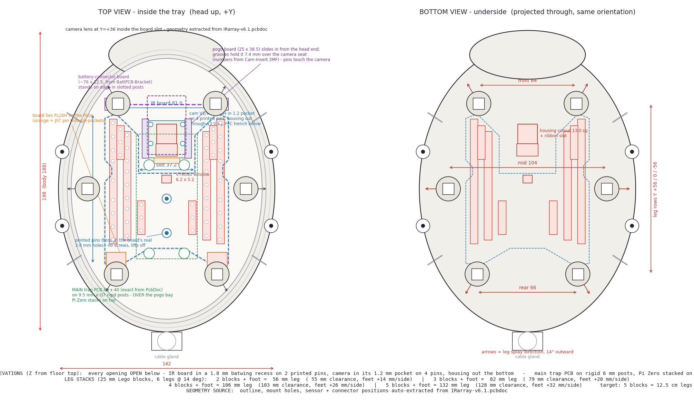
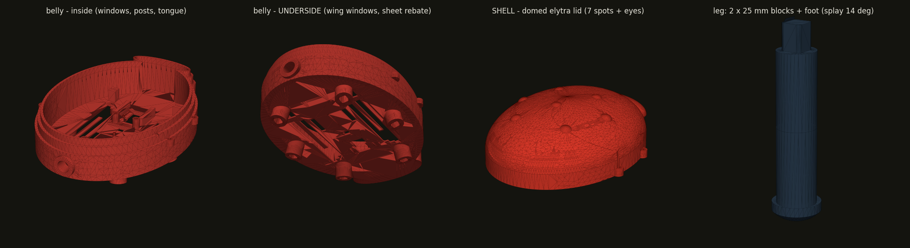

# Ladybug enclosure 🐞 — v1.2

**v1.2:** ~20 % more floor area (body 142 × 188) and a properly hollow shell
(walls 3.0 / 2.6 mm) — real storage room under the dome. Every hardware mount
sits at the same coordinates as v1.1, so boards swap straight over.

A 3D-printed ladybug that hides the electronics under its shell and looks
**straight down** at whatever it's standing over. Legs are Lego-style stacking
blocks, so the same body works at 2 cm or 15 cm off the ground.

**Part 1 (here): the belly** — [`ladybug_belly.py`](ladybug_belly.py), a
parametric FreeCAD script. [`make_drawing.py`](make_drawing.py) generates a
dimensioned top/bottom drawing from the same parameters.
**Part 2 (also here): the domed elytra shell** — `build_shell()` in the same
script, so the seal dimensions can never drift apart.




The IR board's geometry was pulled **straight out of the Altium file** (see
[`irboard_extracted.png`](irboard_extracted.png)) — outline, mount holes,
sensor and connector positions are manufacturing-exact.

## How the real hardware mounts

Everything lives **inside** the body. Measured off the actual boards:

| Part | Where it goes | How |
|---|---|---|
| **IR board** (batwing X, 81 × 98.4 — exact from the PcbDoc) | Drops into a **1.8 mm batwing recess** (~1 mm slack) onto **two printed pins** through its real holes (0,−6.5)/(0,−29.1) — no screws, lifts straight off | The floor has **one slot per LED column** (sized to the exact 48 LED positions from the PcbDoc; touching columns merge) — only the diode zones and the light sensor are open. The centre strip (logo, mount holes, the JST pins, the sensor legs) stays over solid floor, and the board **seals its own opening**: LEDs drop into the windows, the sensor into its hole, the JST pin fields into through-pockets. Silicone/foam on the strip makes it airtight |
| **Light sensor** (VT90N1 at (0,+6.3) — from the PcbDoc) | Its own **rectangular window (6.2 × 5.2)** matching the CdS cell's body | Reads ambient light straight down |
| **Camera** (Pi V2 **or** V3 — same 25 × 24 board, 21 × 12.5 holes) | **Flush in a 1.2 mm floor pocket** inside the board slot, located by **four printed pins** (Ø1.8 in its 2.2 mm holes) | Only the **sensor housing pokes out** through a 13 mm square cutout (passes the bulky Module 3 housing), with a wide offset slot that swallows both the V3 ribbon and V2's L-shaped flex; a shallow trench lets the main FFC cable lie flat. Above it, **slide-in rails carry the pogo interface board** (25 × 38.5) exactly 7.4 mm over the camera seat — spacing decoded from `Cam-Insert.3MF` — so the pogo pins land on the camera's back |
| **Main trap PCB** (82 × 40, holes 58 × 23 — exact from its PcbDoc) | Across the body on rigid 9.5 mm × Ø7 posts, riding just above the pogo board | Upper posts stand in the camera slot, lower ones below the board's bottom edge; the **Pi Zero stacks onto the trap PCB's own 58 × 23 pattern** |

> **Sealing:** there is **no window sheet** — every opening is filled by the
> component that uses it, and the boards clamped flush **are** the seal. The
> openings face the ground, so rain can't fall in. Conformal-coat the IR
> board's LED face (or spray it with clear lacquer) for damp nights.

The board keeps **~1.5–6 mm wiggle room** to the cavity wall all the way round —
it drops in flat and lifts out without a fight.

## Build it

FreeCAD 1.0+ (free). Either open the script in FreeCAD's Python console, or run
it headless — it writes STLs into `stl/` and a `ladybug.FCStd` you can open and
edit:

```bash
"C:\Program Files\FreeCAD 1.0\bin\FreeCADCmd.exe" ladybug_belly.py
```

It prints a check per part; every one must say `printable=True` (a single closed
solid). Current output:

Every run builds **both size options** — same features, shared legs:

| Part | v1.1 (1:1 original) | v1.2 (+20% floor) |
|---|---|---|
| `belly` | 135 × 185 × 54 mm, ~174 cm³ → `stl/v1.1/` | 146 × 201 × 54 mm, ~195 cm³ → `stl/v1.2/` |
| `shell` | 136 × 186 × 59 mm, ~137 cm³ → `stl/v1.1/` | 148 × 202 × 59 mm, ~154 cm³ → `stl/v1.2/` |

Both shells are the hollow thin-wall design; legs below fit either body.

| Shared part | Size | Volume |
|---|---|---|
| `leg_segment` | Ø13 × 35 mm (25 body + 10 peg) | 3.1 cm³ |
| `leg_segment_half` | Ø13 × 22.5 mm | 1.5 cm³ |
| `foot` | Ø16 collar + ball, 16.5 mm | 1.4 cm³ |

## The waterproof lid ("lift") — how the seal works

The shell is a **lid that lifts straight off**. Water never gets a straight path
in, because the joint is a labyrinth:

```
        shell skirt (part 2)
          |  ||                  skirt hangs OUTSIDE, down over the rebate
          |  ||   __ tongue      belly tongue rises INSIDE the skirt,
          |  ||  |  |            into a matching groove in the shell
       ___|  ||__|  |___         seat + gutter, with weep notches
      |      belly       |
       \__ shoulder: skirt edge stops here, water drips off __/
```

- Rain runs down the shell and **drips off the skirt's bottom edge** at the
  shoulder — below and outside the joint.
- To get in, water would have to climb **8 mm up a gap and over a 6 mm tongue**.
  It can't; gravity is on our side.
- Any splash that does land in the gutter drains out through the **weep
  notches** cut in the top of the rebate wall.
- The **screw ears are outside the seal**, so the fixings can't leak.
- The **leg sockets are blind** — they open downward only and never break
  through the floor into the dry side.

Two things you still add by hand:

1. **The gasket.** Run a thin bead of silicone (or lay 1 mm foam tape) on
   the floor's centre strip and around the camera pocket before pressing the
   boards down — PCB on plastic is weather-resistant, silicone makes it
   airtight (and still peels open for service).
2. **A vent.** A fully sealed box breathes with temperature and sucks moisture
   past any seal. Stick a small square of PTFE/Gore vent tape over a 3 mm hole
   drilled high on a side wall, or accept the (slightly leaky) cable gland as
   your vent.

## Printing

| Part | Qty | Notes |
|---|---|---|
| `belly` | 1 | Print as-is, belly down. The leg bosses are the only overhang and they're short — no supports needed. |
| `shell` | 1 | Print as modelled (skirt ring down). The dome is self-supporting; the groove bridges are ~3 mm — fine. Red filament, black spots with a marker (or pause-and-swap). |
| `leg_segment` | 30 (6 legs × 5) | 25 mm each — 5 per leg ≈ 12.5 cm legs. |
| `leg_segment_half` | 4–8 | 12.5 mm fine-adjust blocks for slopes. |
| `foot` | 6 | Print peg-up. |

0.2 mm layers, 3 perimeters, 20–30 % infill. **PETG or ASA if it lives
outdoors** — PLA sags in a sun-baked enclosure. TPU feet grip better and damp
vibration.

> **Print one `leg_segment` + one `foot` first** and check the peg grip. Too
> loose → lower `fit` (0.15–0.2). Too tight → raise it (0.4–0.5). Printer
> tolerance varies more than the model does; this one number is the whole trick.

## Height adjustment (the Lego bit)

**Six legs — front, middle and rear pairs — tilted 14° outward** like a
tripod. The system is LEGO-simple: **round parts outside (Ø13 blocks, Ø16
belly bosses, Ø16 ball feet), ONE standard square hole inside** — a straight
7.15 mm peg in a 7.45 mm rounded-corner socket — 0.3 mm of wiggle: drops
together by hand, no slop. (The peg also fits bellies printed with the older
7.4 sockets, at 0.25 play.) The foot's top is a straight collar at exactly
`socket_od`, so the joint reads as one continuous column — if your printed
belly's bosses measure differently, set `socket_od` and reprint only the feet. 10 mm engagement + blocks butting face-to-face keep tall stacks
stiff instead of wobbling up. The belly sockets are angled,
so the taller you stack, the wider the stance. Every `leg_segment` adds **25 mm**
along the leg:

```
belly socket (14° out) → [block] → [block] → ... → [foot]
```

| Blocks per leg | Leg length | Ground clearance | Feet spread |
|---|---|---|---|
| 2 | 56 mm | 54 mm | +14 mm/side |
| 3 | 81 mm | 79 mm | +20 mm/side |
| 4 | 106 mm | 103 mm | +26 mm/side |
| **5** | **131 mm ≈ 12.5 cm** | **127 mm** | **+32 mm/side** |

- **Square pegs** mean the legs can't rotate — the splay angle stays put.
- **Why 14°?** The camera sees ~62° × 49°, so no sane splay keeps legs out
  of the extreme corners at every height — 14° keeps the upper leg sections
  (the close, blurry, dominant ones) out of view at working heights without
  making the stance silly. If you build very tall and the corners bother you,
  raise `leg_splay` a few degrees and reprint just the belly.
- Stack the downhill legs taller (use the half blocks) to stand level on a slope.

**Camera height is your focus knob.** The IMX708 won't focus closer than ~10 cm,
so print enough segments to bracket 10–20 cm.

## Fitting your hardware

Everything is in the `PARAMS` block at the top of the script — change a number,
re-run. The ones you'll actually touch:

| Param | What it does |
|---|---|
| `body_len`, `body_wid` | Overall footprint |
| `ir_outline` | The exact batwing outline (auto-extracted from `IRarray-v6.1.pcbdoc`) |
| `ir_mounts`, `sensor_pos` | Exact centreline holes + VT90N1 spot (from the PcbDoc) |
| `win_inset`, `win_xmin` | Wing-window fit: rim width and solid-strip width |
| `cam_pos`, `cam_lens_d` | Camera lens hole (Ø12 clears V2 and V3) |
| `cam_cut_sq`, `cam_fit` | Camera housing cutout + pocket tightness |
| `main_posts`, `main_post_h` | Trap-PCB standoffs (58 × 23 pattern, from its PcbDoc) |
| `leg_splay`, `leg_seg_h` | Tripod angle and block height |
| `fit` | Leg peg tightness |
| `skirt_th`, `skirt_gap`, `tongue_w`, `tongue_h` | The seal — part 2 must match these |

> ⚠️ Before printing the belly, measure and set: `ir_mounts` (the two
> centreline holes), `sensor_pos`, and check the notch/outline against your
> PCB. Everything else is dimensioned from the real hardware.
> The legs are safe to print right now.

### Internal layout (bottom → top)

| Z from floor top | What |
|---|---|
| 0–3 mm | Floor, with wing windows + sensor + lens holes; clear sheet in the rebate below |
| 3 mm | Camera posts — lens reaches down into its hole, baffle collar around it |
| below 0 | Camera **sensor housing pokes out** (V2 ~2.5 mm, V3 ~5 mm); LED domes sit just inside their windows |
| 0–3 mm | Floor — **IR board and camera both recessed flush on printed pins**, sealing their own openings |
| 13 mm | **Main trap PCB** on 10 mm posts; the Pi Zero stacks onto it above |
| 33 mm | Seat level — the shell's skirt lands here |

## Still to design

- [x] The domed **elytra shell** — seven-spot dome with eye bumps, skirt +
      groove matched to the belly, four M3 tabs over the belly ears.
      (The centre split line defeated the CAD kernel — draw it with a marker.)
- [ ] Lens hood / dew shield around the camera port.
- [ ] Head with the "eyes" as vent detail.
